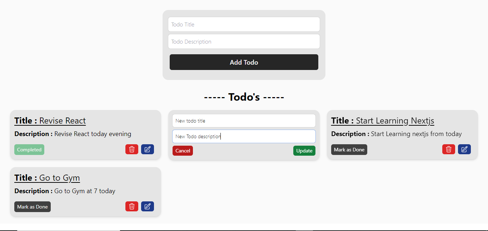

## Todo App
This is a simple todo app that has following features - 
- User can add a todo
- User can Mark the todo as done
- User can edit a todo
- User can delete a todo

## Todo App Demo

## Technologies Used
The following technologies were used in the development of this project:
- Node.js
- Express.js
- MongoDB
- Tailwind
- React

## Getting Started
To get started with Todo application, follow these steps:

1. Clone the repository: **`https://github.com/dhaliwalarsh49/Todo-app.git`**
2. Open the project folder: **`cd Todo-app`**
3. Open the backend folder: **`cd backend`**
4. Install the dependencies: **`npm i`**
5. Start the backend: **`npm run start`**
6. Open the frontend folder: **`cd frontend`**
7. Install the dependencies: **`npm i`**
8. Start the frontend: **`npm run dev`**
